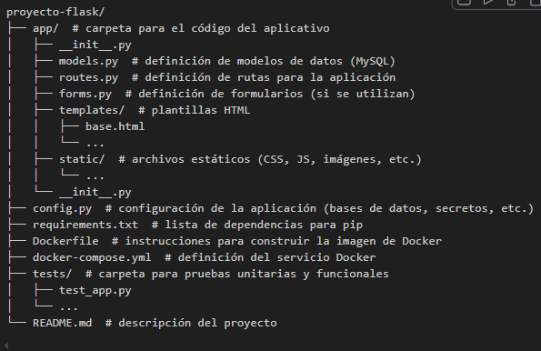

# Comandos para Desplegar
Construir y levantar el sistema:
    ' docker-compose up --build '

Crear las tablas iniciales (migraciones):
    ' docker-compose exec web flask db init '
    ' docker-compose exec web flask db migrate '
    ' docker-compose exec web flask db upgrade '

OJO
https://chatgpt.com/c/6751154c-f860-800e-9786-0d4b71953b8c

https://josejuansanchez.org/bd/practica-07/index.html#c%C3%B3mo-enlazar-phpmyadmin-con-un-contenedor-docker-con-mysql-o-mariadb